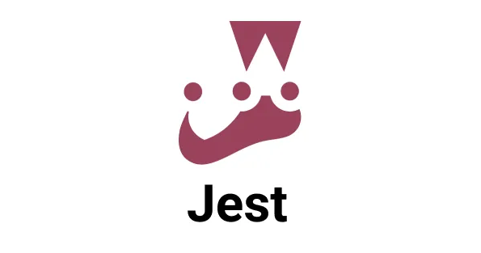

  

<h1 align="center"> Testes Automatizados  </h1>

  

<h3> Sobre:</h3>

  Jest é um framework de teste de código JavaScript, de código aberto, que permite escrever e executar testes unitários, de integração e de interface. Ele foi desenvolvido pelo Facebook para testar o framework React. O Jest é utilizado para: Garantir a qualidade e a confiabilidade do código, Criar software mais robusto e confiável, Testar aplicativos web, Testar frameworks JavaScript. 
 

## Tecnologias ##

- TypeScript
- NodeJS
- Framework Jest
- Biblioteca Supertest

